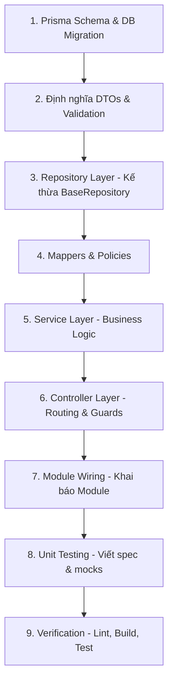

<!-- headroom:rtk-instructions -->
# RTK (Rust Token Killer) - Token-Optimized Commands

When running shell commands, **always prefix with `rtk`**. This reduces context
usage by 60-90% with zero behavior change. If rtk has no filter for a command,
it passes through unchanged — so it is always safe to use.

## Key Commands
```bash
# Git (59-80% savings)
rtk git status          rtk git diff            rtk git log

# Files & Search (60-75% savings)
rtk ls <path>           rtk read <file>         rtk grep <pattern>
rtk find <pattern>      rtk diff <file>

# Test (90-99% savings) — shows failures only
rtk pytest tests/       rtk cargo test          rtk test <cmd>

# Build & Lint (80-90% savings) — shows errors only
rtk tsc                 rtk lint                rtk cargo build
rtk prettier --check    rtk mypy                rtk ruff check

# Analysis (70-90% savings)
rtk err <cmd>           rtk log <file>          rtk json <file>
rtk summary <cmd>       rtk deps                rtk env

# GitHub (26-87% savings)
rtk gh pr view <n>      rtk gh run list         rtk gh issue list

# Infrastructure (85% savings)
rtk docker ps           rtk kubectl get         rtk docker logs <c>

# Package managers (70-90% savings)
rtk pip list            rtk pnpm install        rtk npm run <script>
```

## Rules
- In command chains, prefix each segment: `rtk git add . && rtk git commit -m "msg"`
- For debugging, use raw command without rtk prefix
- `rtk proxy <cmd>` runs command without filtering but tracks usage
<!-- /headroom:rtk-instructions -->

---

# Backend Coding Rules & Standard Development Flow for AI Agents

Tài liệu này là **kim chỉ nam bắt buộc (Standard Operating Procedure - SOP)** dành cho mọi AI coding agent (Gemini, Claude, GPT, Cursor, Devin, v.v.) khi phát triển, chỉnh sửa hoặc tối ưu hóa mã nguồn trong thư mục `backend/`.

---

## 1. Tổng quan Kiến trúc & Tech Stack

- **Framework:** NestJS 11 (Express platform)
- **Language:** TypeScript 5.7+ (Chế độ `strict: true`)
- **Database & ORM:** PostgreSQL (Supabase) + Prisma 7 (`@prisma/adapter-pg`, `@prisma/client`)
- **Kiến trúc:** Layered Architecture / Domain-Driven Modular Design
- **Validation:** `class-validator` + `class-transformer` (Strict Global Validation Pipe)
- **Logging:** `nestjs-pino` + `pino-http`
- **Authentication & Authorization:** JWT Guard (`JwtAuthGuard`), Argon2, HttpOnly cookie & Bearer token
- **Real-time & Events:** Server-Sent Events (SSE) via `EventsService` (RxJS), Socket.io WebSockets
- **Testing:** Jest + `ts-jest` + Supertest (Unit test `*.spec.ts`, E2E test `*.e2e-spec.ts`)

---

## 2. Các nguyên tắc cốt lõi (Strict Guardrails - Bắt buộc tuân thủ)

### 2.1. Zero Warnings / Zero Errors Policy
- Mọi thay đổi code **KHÔNG ĐƯỢC PHÉP** tạo ra bất kỳ lỗi TypeScript (`tsc`), cảnh báo (warnings), hoặc vi phạm ESLint nào.
- Tuyệt đối hạn chế sử dụng kiểu `any`. Khi bắt buộc phải làm việc với kiểu dữ liệu chưa xác định, dùng `unknown` hoặc generic types có type narrowing / type guard.
- Khai báo đầy đủ kiểu trả về (explicit return types) cho mọi method trong Controller, Service, Repository.

### 2.2. Phân tách trách nhiệm rõ ràng (Single Responsibility)
- **Controller:** CHỈ chịu trách nhiệm tiếp nhận HTTP request, validate guard/auth, trích xuất parameters/body, gọi Service và trả về Response. **TUYỆT ĐỐI KHÔNG** viết business logic hoặc truy vấn DB trong Controller.
- **Service:** Xử lý toàn bộ nghiệp vụ (business logic), điều phối các Repository, gọi các service hỗ trợ (Scraper, Parser, Storage, AI), bắn domain event.
- **Repository:** Trừu tượng hóa truy vấn cơ sở dữ liệu qua Prisma. Kế thừa từ `BaseRepository`. **TUYỆT ĐỐI KHÔNG** inject hoặc gọi `PrismaService` trực tiếp trong Controller hoặc Service.
- **DTOs & Mappers:** Phân tách rõ ràng giữa Input DTO và Response DTO. Dùng `Mapper` để chuyển đổi Prisma Model sang Response DTO trước khi trả về client.
- **Policies:** Tách riêng logic kiểm tra quyền sở hữu (ownership) và phân quyền vào thư mục `policies/`.

### 2.3. Data Isolation & Bảo mật Multi-Tenancy
- Tất cả các endpoint bảo vệ (`@UseGuards(JwtAuthGuard)`) phải trích xuất `userId` từ `req.user.id`.
- Mọi câu lệnh truy vấn, thêm, sửa, xóa dữ liệu thuộc về người dùng **BẮT BUỘC PHẢI** có điều kiện `userId` (hoặc kiểm tra ownership thông qua policy như `ensureNoteOwnership`).
- Không bao giờ để rò rỉ dữ liệu của user khác.

### 2.4. Strict Input Validation với Global Pipe
Trong `src/main.ts`, `ValidationPipe` được cấu hình nghiêm ngặt:
```typescript
app.useGlobalPipes(
  new ValidationPipe({
    whitelist: true,
    forbidNonWhitelisted: true,
    transform: true,
    transformOptions: {
      enableImplicitConversion: true,
    },
  }),
);
```
> [!IMPORTANT]
> Vì có `forbidNonWhitelisted: true`, bất kỳ thuộc tính nào gửi lên không được định nghĩa trong DTO kèm decorator của `class-validator` sẽ gây lỗi **400 Bad Request** ngay lập tức! Mọi field đều phải được khai báo và validate rõ ràng.

### 2.5. Structured Logging & Error Handling
- Không sử dụng `console.log` / `console.error` trong code backend.
- Luôn khởi tạo logger chuẩn của NestJS/Pino:
  ```typescript
  private readonly logger = new Logger(ServiceName.name);
  ```
- Ném ra các HTTP Exception chuẩn của NestJS (`BadRequestException`, `NotFoundException`, `UnauthorizedException`, `ForbiddenException`, `ConflictException`).

---

## 3. Cấu trúc thư mục chuẩn cho Feature Module (Folder Blueprint)

Mỗi tính năng/domain phải được đặt trong một thư mục riêng biệt tại `src/<feature>/`, tuân thủ cấu trúc sau:

```
src/<feature>/
├── constants/             # Enums, hằng số domain (status, categories, keys)
├── dto/                   # Data Transfer Objects
│   ├── create-<feature>.dto.ts        # Input DTO tạo mới (class-validator)
│   ├── update-<feature>.dto.ts        # Input DTO cập nhật (PartialType)
│   ├── find-all-<feature>-query.dto.ts# Query param DTO cho pagination/filter
│   └── <feature>-response.dto.ts      # Response DTO trả về cho client
├── repository/            # Tầng Data Access
│   └── <feature>.repository.ts        # Kế thừa BaseRepository, truy vấn Prisma
├── mappers/               # Ánh xạ Entity -> Response DTO
│   └── <feature>.mapper.ts            # Hàm tĩnh toResponseDto, toResponseDtoList
├── policies/              # Kiểm tra quyền hạn & sở hữu
│   └── <feature>.policy.ts            # Assertions (ví dụ: ensureOwnership)
├── utils/                 # Utility thuần túy của riêng feature
│   └── <feature>-helper.util.ts
├── validators/            # Custom class-validator decorators (nếu có)
├── types/                 # Types, Interfaces, SSE Event types nội bộ
├── tests/                 # Unit tests cho controller, service, utils
│   ├── <feature>.controller.spec.ts
│   ├── <feature>.service.spec.ts
│   └── <feature>.repository.spec.ts
├── <feature>.controller.ts# HTTP Controller
├── <feature>.service.ts   # Core Business Service
└── <feature>.module.ts    # Module configuration
```

---

## 4. Flow viết Backend chuẩn 9 bước (Step-by-Step Flow)

Khi AI Agent nhận nhiệm vụ tạo mới hoặc cập nhật một tính năng backend, **BẮT BUỘC** thực hiện tuần tự theo 9 bước dưới đây:



### Bước 1: Cập nhật Database Schema (Prisma)
Nếu tính năng yêu cầu thay đổi dữ liệu:
1. Mở `prisma/schema.prisma` và khai báo / điều chỉnh model, relations, indexes, enums.
2. Đặt index hợp lý cho các trường hay tìm kiếm hoặc sắp xếp (`createdAt`, `userId`, `status`).
3. Chạy migration và generate client:
   ```bash
   npx prisma migrate dev --name <ten_tinh_nang>
   npx prisma generate
   ```

### Bước 2: Định nghĩa DTOs (Input & Response DTOs)
1. **Input DTOs:** Đặt trong `src/<feature>/dto/`. Sử dụng `class-validator` và `class-transformer`:
   - Luôn sử dụng `@Transform` để chuẩn hóa (trim chuỗi rỗng về `undefined` nếu là trường optional).
   - Đảm bảo mọi field client có thể gửi đều có decorator tương ứng.
2. **Response DTO:** Định nghĩa cấu trúc dữ liệu chính xác mà API sẽ trả về, tránh trả về các trường nhạy cảm như hashed password, internal token, v.v.

*Ví dụ Create DTO:*
```typescript
import { Transform } from 'class-transformer';
import { IsOptional, IsString, IsNotEmpty } from 'class-validator';

export class CreateItemDto {
  @Transform(({ value }: { value: unknown }) =>
    typeof value === 'string' ? value.trim() : value,
  )
  @IsString()
  @IsNotEmpty()
  title: string;

  @Transform(({ value }: { value: unknown }) =>
    typeof value === 'string' && value.trim() === '' ? undefined : value,
  )
  @IsOptional()
  @IsString()
  description?: string;
}
```

### Bước 3: Tạo / Cập nhật Repository Layer
1. Tạo file trong `src/<feature>/repository/<feature>.repository.ts`.
2. Kế thừa từ `BaseRepository<T, CreateInput, UpdateInput>` (từ `src/common/repositories/base.repository.ts`).
3. Nhận `PrismaService` qua dependency injection và truyền delegate tương ứng vào `super(prisma.<model>)`.
4. Mọi query lọc dữ liệu theo user BẮT BUỘC nhận tham số `userId`.

*Ví dụ Repository:*
```typescript
import { Injectable } from '@nestjs/common';
import { PrismaService } from '../../prisma/prisma.service';
import { Item, Prisma } from '@prisma/client';
import { BaseRepository } from '../../common/repositories/base.repository';

@Injectable()
export class ItemsRepository extends BaseRepository<
  Item,
  Prisma.ItemCreateInput,
  Prisma.ItemUpdateInput
> {
  constructor(protected readonly prisma: PrismaService) {
    super(prisma.item);
  }

  async findByUserId(userId: string, limit = 20): Promise<Item[]> {
    return this.prisma.item.findMany({
      where: { userId },
      orderBy: { createdAt: 'desc' },
      take: limit,
    });
  }
}
```

### Bước 4: Tạo Mappers & Policies
1. **Mapper:** Tạo `src/<feature>/mappers/<feature>.mapper.ts` với các phương thức static:
   - `toResponseDto(entity: Entity): EntityResponseDto`
   - `toResponseDtoList(entities: Entity[]): EntityResponseDto[]`
   - Xử lý các logic mapping như gắn base URL cho file uploads, format ngày tháng, extract bullets.
2. **Policy:** Tạo `src/<feature>/policies/<feature>.policy.ts` với các assertion functions:
   - `ensureOwnership(entity: Entity | null, userId: string, id: string): asserts entity is Entity`
   - Ném ra `NotFoundException` nếu không tìm thấy hoặc `userId` không trùng khớp.

*Ví dụ Policy:*
```typescript
import { NotFoundException } from '@nestjs/common';
import { Item } from '@prisma/client';

export function ensureItemOwnership<T extends Item>(
  item: T | null,
  userId: string,
  itemId: string,
): asserts item is T {
  if (!item || item.userId !== userId) {
    throw new NotFoundException(`Item with ID ${itemId} not found`);
  }
}
```

### Bước 5: Viết Service Layer (Core Business Logic)
1. Đặt trong `src/<feature>/<feature>.service.ts`.
2. Inject Repository và các services phụ thuộc qua constructor.
3. Điều phối nghiệp vụ:
   - Validate nghiệp vụ bổ sung (nếu DTO chưa bao quát hết).
   - Gọi Repository để lưu trữ/truy vấn dữ liệu.
   - Sử dụng Policy để kiểm tra quyền sở hữu.
   - Bắn sự kiện qua `EventsService` (nếu cần cập nhật realtime / SSE).
   - Sử dụng Mapper để trả về Response DTO.

### Bước 6: Viết Controller Layer (Routing & Guards)
1. Đặt trong `src/<feature>/<feature>.controller.ts`.
2. Áp dụng `@UseGuards(JwtAuthGuard)` cho các route yêu cầu xác thực.
3. Khai báo interface `AuthRequest extends Request { user: { id: string; role: string } }`.
4. Trích xuất thông tin bằng:
   - `@Req() req: AuthRequest` -> Lấy `req.user.id`.
   - `@Body() dto: CreateItemDto`
   - `@Param('id') id: string`
   - `@Query() query: FindAllQueryDto`
5. Khai báo explicit return types: `Promise<ItemResponseDto>` hoặc `Promise<ItemResponseDto[]>`.
6. Trả về đúng HTTP status code (`@HttpCode(HttpStatus.CREATED)`, `@HttpCode(HttpStatus.OK)`).

*Ví dụ Controller:*
```typescript
import {
  Controller,
  Get,
  Post,
  Body,
  Param,
  UseGuards,
  Req,
  HttpCode,
  HttpStatus,
} from '@nestjs/common';
import { ItemsService } from './items.service';
import { CreateItemDto } from './dto/create-item.dto';
import { ItemResponseDto } from './dto/item-response.dto';
import { JwtAuthGuard } from '../common/guards/jwt-auth.guard';
import type { Request } from 'express';

interface AuthRequest extends Request {
  user: { id: string; role: string };
}

@Controller('items')
@UseGuards(JwtAuthGuard)
export class ItemsController {
  constructor(private readonly itemsService: ItemsService) {}

  @Post()
  @HttpCode(HttpStatus.CREATED)
  create(
    @Body() dto: CreateItemDto,
    @Req() req: AuthRequest,
  ): Promise<ItemResponseDto> {
    return this.itemsService.create(dto, req.user.id);
  }

  @Get(':id')
  findOne(
    @Param('id') id: string,
    @Req() req: AuthRequest,
  ): Promise<ItemResponseDto> {
    return this.itemsService.findOne(id, req.user.id);
  }
}
```

### Bước 7: Cấu hình Module (Wiring)
1. Trong `src/<feature>/<feature>.module.ts`:
   - `imports`: Nhập các module liên quan (ví dụ `PrismaModule`, `EventsModule`, `StorageModule`).
   - `controllers`: Đăng ký `<Feature>Controller`.
   - `providers`: Đăng ký `<Feature>Service`, `<Feature>Repository`, Gateways.
   - `exports`: Xuất `<Feature>Service` hoặc `<Feature>Repository` nếu module khác cần gọi tới.
2. Nếu là module mới, import `<Feature>Module` vào `src/app.module.ts`.

### Bước 8: Viết Unit Tests (TDD / Mocking)
1. Viết test case trong `src/<feature>/tests/` hoặc `<feature>.service.spec.ts`.
2. Mock tất cả dependencies (Repository, Scraper, AI, EventsService) bằng Jest:
   ```typescript
   const mockRepo = {
     create: jest.fn(),
     findById: jest.fn(),
     findAll: jest.fn(),
   };
   ```
3. Kiểm tra cả Happy Path và Edge Cases (lỗi 404 khi không tồn tại hoặc sai userId, lỗi 400 khi thiếu dữ liệu bắt buộc).

### Bước 9: Kiểm tra chất lượng (Verification Routine)
Trước khi kết thúc task hoặc claim hoàn thành, AI Agent **BẮT BUỘC** chạy và kiểm tra đầu ra của 3 lệnh sau:

```bash
# 1. Kiểm tra Linting & Formatting
npm run lint

# 2. Kiểm tra TypeScript Compilation & Build
npm run build

# 3. Chạy toàn bộ Unit Tests
npm run test
```
- Nếu có bất kỳ lỗi nào xuất hiện, phải sửa chữa ngay lập tức cho đến khi tất cả đều trả về **Exit Code 0**.

---

## 5. Bảng tra cứu Exception & HTTP Status Codes chuẩn

| Tình huống | Exception ném ra | HTTP Code | Ghi chú |
| :--- | :--- | :--- | :--- |
| Dữ liệu gửi lên sai định dạng hoặc thiếu trường | `BadRequestException('Thông báo rõ ràng')` | 400 | Global pipe tự bắt, hoặc ném thủ công |
| Chưa đăng nhập hoặc token hết hạn | `UnauthorizedException('Invalid token')` | 401 | Do `JwtAuthGuard` quản lý |
| Không có quyền truy cập resource | `ForbiddenException('Forbidden access')` | 403 | Khi user không có quyền trên tài nguyên |
| Không tìm thấy resource hoặc không thuộc user | `NotFoundException('Resource not found')` | 404 | Luôn giấu việc resource có tồn tại nếu thuộc user khác |
| Dữ liệu bị trùng lặp (email, key, slug) | `ConflictException('Already exists')` | 409 | Khi vi phạm unique constraint |
| File upload sai định dạng hoặc quá dung lượng | `ParseFilePipeBuilder` (UNPROCESSABLE_ENTITY) | 422 | Cấu hình tại File Interceptor |
| Lỗi hệ thống bất ngờ (database crash, unhandled) | `HttpExceptionFilter` tự động bắt | 500 | Log đầy đủ stack trace với Pino |

---

## 6. Real-time (SSE & WebSockets) Guidelines

1. **Server-Sent Events (SSE):**
   - Đặt endpoint tại Controller với decorator `@Sse('events')`.
   - Kết nối với `EventsService` và trả về `Observable<MessageEvent>`.
   - Các sự kiện domain khi entity thay đổi được bắn qua `eventsService.emit(domainEvent)` trong Service.
2. **WebSockets (Socket.io):**
   - Đặt trong `src/<feature>/gateway/<feature>.gateway.ts`.
   - Sử dụng `@WebSocketGateway({ cors: { origin: ... } })`.
   - Kế thừa lifecycle hooks `OnGatewayInit`, `OnGatewayConnection`, `OnGatewayDisconnect` khi cần quản lý phòng hoặc socket state.
